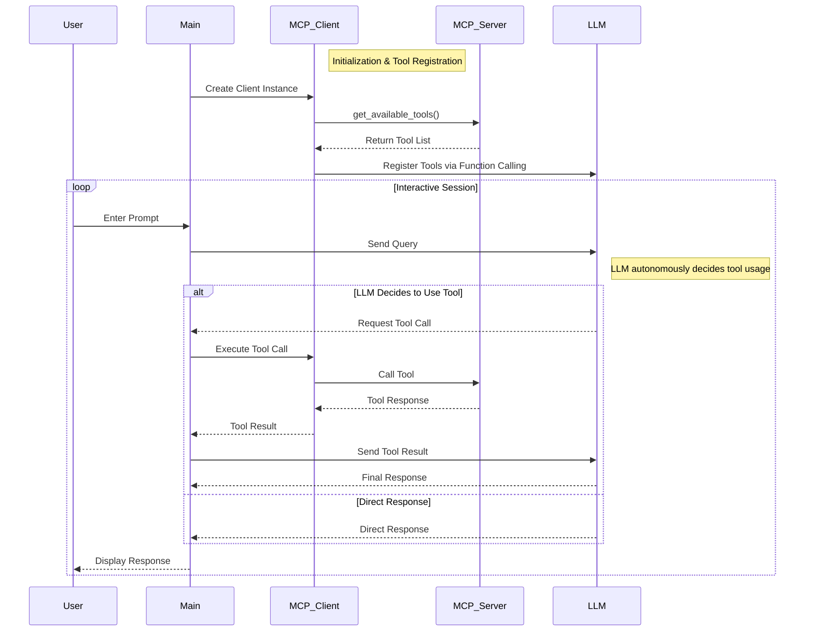

# Overview

Inspired by [mcp-openai-gemini-llama-example](https://github.com/philschmid/mcp-openai-gemini-llama-example).

This is an agent based on the MCP protocol that can directly operate a SQLite database using natural language, and the LLM service is compatible with OpenAI format.

What this agent do:



# Motivation

This project is intended to explain: **How does an LLM perceive external protocols through MCP?**

Considering that MCP was proposed by `Anthropic`, I [did not see](https://github.com/modelcontextprotocol/python-sdk/issues/161) any good examples of LLM interacting with MCP on the official MCP website. Here, I provide OpenAI's version, which theoretically can run this case as long as any **OpenAI interface-compatible LLM model supports Function Calling.**

The project actually has a high degree of overlap with the [mcp-openai-gemini-llama-example](https://github.com/philschmid/mcp-openai-gemini-llama-example) , but due to issues like dependency conflicts and code conflicts in the original repository, it is quite messy. So I specifically created this repository to clarify the problems I mentioned in my motivation.

# Setup & Executing
Setup environment：

Add `.env` to the project according to `.env.template` and fill in your OPENAI service provider information.

```bash
conda create -n tiny-oai-mcp-agent python=3.11
pip install -r requirements.txt
python agent.py
```

Example 1:
```bash
Enter your prompt (or 'quit' to exit): show tables

Response: Here are the tables available in the database:

1. **users**
2. **stock**

If you need more information about either of these tables or want to perform operations on them, just let me know!

Enter your prompt (or 'quit' to exit): create table students with 4 columuns for me, decide column detail by yourself

Response: The table **students** has been created successfully with the following columns:

1. **id**: INTEGER PRIMARY KEY
2. **name**: TEXT NOT NULL
3. **age**: INTEGER NOT NULL
4. **enrollment_date**: DATE NOT NULL

If you need to add data to this table or perform any further actions, feel free to ask!

Enter your prompt (or 'quit' to exit): show tables

Response: Now, in addition to the previous tables, the database also contains the newly created **students** table. Here’s the updated list:

1. **users**
2. **stock**
3. **students**

If you have any tasks in mind for these tables or need more information, just let me know!
```

Example 2:
```bash
(mcp-example) Warren@L-MBP Tiny-OAI-MCP-Agent % python mcp_client.py 

Enter your prompt (or 'quit' to exit): hi

Response: Hello! How can I assist you today?

Enter your prompt (or 'quit' to exit): show tables from my db

Response: Here are the tables in your database:

1. **users**
2. **stock**
3. **students**

If you need more information about any of these tables or want to perform any specific task, just let me know!

Enter your prompt (or 'quit' to exit): show metadata from users

Response: The "users" table has the following structure:

- **id**: INTEGER, Primary Key (optional, can be null)
- **name**: TEXT, Not Null
- **age**: INTEGER, Not Null

If you need to know anything else or want to perform any operations on this table, feel free to ask!

Enter your prompt (or 'quit' to exit): quit

```
