# Overview

Inspired by [mcp-openai-gemini-llama-example](https://github.com/philschmid/mcp-openai-gemini-llama-example).

This is an agent based on the MCP protocol that can directly operate a SQLite database using natural language, and the LLM service is compatible with OpenAI format.

What this agent do:


# Motivation

This project is intended to explain: **How does an LLM perceive external protocols through MCP?**

Considering that MCP was proposed by `Anthropic`, I [did not see](https://github.com/modelcontextprotocol/python-sdk/issues/161) any good examples of LLM interacting with MCP on the official MCP website. Here, I provide OpenAI's version, which theoretically can run this case as long as any **OpenAI interface-compatible LLM model supports Function Calling.**

The project actually has a high degree of overlap with the [mcp-openai-gemini-llama-example](https://github.com/philschmid/mcp-openai-gemini-llama-example) , but due to issues like dependency conflicts and code conflicts in the original repository, it is quite messy. So I specifically created this repository to clarify the problems I mentioned in my motivation.

# Function Calling Support

Please ensure that the model of the service provider you are using supports Function Calling. Note that whether Function Calling is supported is related to the provider and also to the model; **some models support Function Calling, but the provider deploying that model may not necessarily support it.**

How to check if the model & provider supports function calling? 

For example:

**openrouter.ai** (Well this is a freaking display, as if it doesn't want to be seen.):


**fireworks.ai**:


# Setup & Executing

## .env

Add `.env` to the project according to `.env.template` and fill in your OPENAI service provider information.

Please refer to the format of the service providers I have tested below:

✅ [OpenRouter](https://openrouter.ai/) + [qwen-turbo](https://openrouter.ai/qwen/qwen-turbo)	

```
OPENAI_API_KEY='sk-xxxxxxxxxxxxxxxxxxxxxxxxxxxxxxxxxxxxx'
OPENAI_API_BASE='https://openrouter.ai/api/v1'
LLM_MODEL='qwen/qwen-turbo'
```

✅ [OpenRouter](https://openrouter.ai/) + [qwen-max](https://openrouter.ai/qwen/qwen-max)

```
OPENAI_API_KEY='sk-xxxxxxxxxxxxxxxxxxxxxxxxxxxxxxxxxxxxx'
OPENAI_API_BASE='https://openrouter.ai/api/v1'
LLM_MODEL='qwen/qwen-max'
```

✅ [OpenRouter](https://openrouter.ai/) + [gpt-4o-mini](https://openrouter.ai/openai/gpt-4o-mini)

```
OPENAI_API_KEY='sk-xxxxxxxxxxxxxxxxxxxxxxxxxxxxxxxxxxxxx'
OPENAI_API_BASE='https://openrouter.ai/api/v1'
LLM_MODEL='openai/gpt-4o-mini'
```

❌ [DeepSeek](https://api.deepseek.com) + deepseek-chat (🙁 Don't know the reason; the request didn't return an error, but it also didn't operate on the database.)

```
OPENAI_API_KEY='sk-xxxxxxxxxxxxxxxxxxxxxxxxxxxxxxxxxxxxx'
OPENAI_API_BASE='https://api.deepseek.com'
LLM_MODEL='deepseek-chat'
```

```
Enter your prompt (or 'quit' to exit): show tables

Response: It seems there are no user-created tables in the database yet. The `sqlite_master` table is a system table that contains metadata about the database, such as the schema of all tables, indexes, and other objects.

If you'd like to create a new table or perform any other operations, feel free to let me know! I can help you with creating tables, inserting data, or querying information. 😊

```

## Python Env

```bash
conda create -n tiny-oai-mcp-agent python=3.11
pip install -r requirements.txt
python agent.py
```

## Output Example

Example 1:

```bash
Enter your prompt (or 'quit' to exit): show tables

Response: Here are the tables available in the database:

1. **users**
2. **stock**

If you need more information about either of these tables or want to perform operations on them, just let me know!

Enter your prompt (or 'quit' to exit): create table students with 4 columuns for me, decide column detail by yourself

Response: The table **students** has been created successfully with the following columns:

1. **id**: INTEGER PRIMARY KEY
2. **name**: TEXT NOT NULL
3. **age**: INTEGER NOT NULL
4. **enrollment_date**: DATE NOT NULL

If you need to add data to this table or perform any further actions, feel free to ask!

Enter your prompt (or 'quit' to exit): show tables

Response: Now, in addition to the previous tables, the database also contains the newly created **students** table. Here’s the updated list:

1. **users**
2. **stock**
3. **students**

If you have any tasks in mind for these tables or need more information, just let me know!
```

Example 2:

```bash
(mcp-example) Warren@L-MBP Tiny-OAI-MCP-Agent % python mcp_client.py 

Enter your prompt (or 'quit' to exit): hi

Response: Hello! How can I assist you today?

Enter your prompt (or 'quit' to exit): show tables from my db

Response: Here are the tables in your database:

1. **users**
2. **stock**
3. **students**

If you need more information about any of these tables or want to perform any specific task, just let me know!

Enter your prompt (or 'quit' to exit): show metadata from users

Response: The "users" table has the following structure:

- **id**: INTEGER, Primary Key (optional, can be null)
- **name**: TEXT, Not Null
- **age**: INTEGER, Not Null

If you need to know anything else or want to perform any operations on this table, feel free to ask!

Enter your prompt (or 'quit' to exit): quit

```

Example 3:

```
(mcp-example) Warren@L-MBP Tiny-OAI-MCP-Agent % python mcp_client.py 

Enter your prompt (or 'quit' to exit): show tabls

Response: It looks like we have a few tables in our database: `users`, `stock`, and `students`. Would you like to know more about any of them? We could check the structure or see what's inside! What would you like to explore first?

Enter your prompt (or 'quit' to exit): show metadata from users            

Response: Sure thing! Here’s the metadata for the `users` table:

- **id**: This is the primary key (unique identifier) for each user and it can hold integer values.
- **name**: This field stores the user's name as text. It's a required field, so every entry must include a value here.
- **age**: This field holds the user's age as an integer. Like the name field, it is also required.

Would you like to dive deeper into this table? For example, we could look at some data within it or even add some new records. Let me know what sparks your interest!

Enter your prompt (or 'quit' to exit): 

```

# LLM Interaction Log Details

Whenever mcp-client sends a request to the LLM, it appends the supported tools to the interface.

```python
  first_response = await client.chat.completions.create(
      model=MODEL,
      messages=messages,
      tools=([t["schema"] for t in tools.values()] if len(tools) > 0 else None),
      max_tokens=4096,
      temperature=0,
  )
```

Therefore, the LLM will trigger and select the appropriate tool, which for the model is a standard Function Calling process. Since we're dealing with Function Calling, at the code level, there will definitely be two requests.

Given that the protocol between MCP-Client and the LLM is HTTP, it naturally follows that we can capture the detailed requests and responses across the entire chain to explore the process in detail. Here, I'm using `lite-llm` as an AI Gateway to capture everything from my Prompt (request) to the LLM's answer (Response).

```mermaid
sequenceDiagram
    participant User as 👷User
    participant Proxy as ☁️ AI Proxy (LiteLLM UI Logs)
    participant LLM as 🤖 LLM Provider(OpenAI Compatible)

    User->>Proxy: Send Request
    Note over User,Proxy: User interaction begins

    Proxy->>Proxy: Log Request Details
    Note over Proxy: Capture request metadata
    
    Proxy->>LLM: Forward Request
    Note over Proxy,LLM: Proxy routes request to LLM

    LLM-->>Proxy: Return Response
    Note over LLM,Proxy: LLM processes and generates response

    Proxy->>Proxy: Log Response Details
    Note over Proxy: Record response metadata

    Proxy->>User: Deliver Response
    Note over Proxy,User: Final response sent back to user

```



If you're interested in the detailed interactions involved in this process, please check out this [link](llm-log-detail(by%20function%20calling).md).

