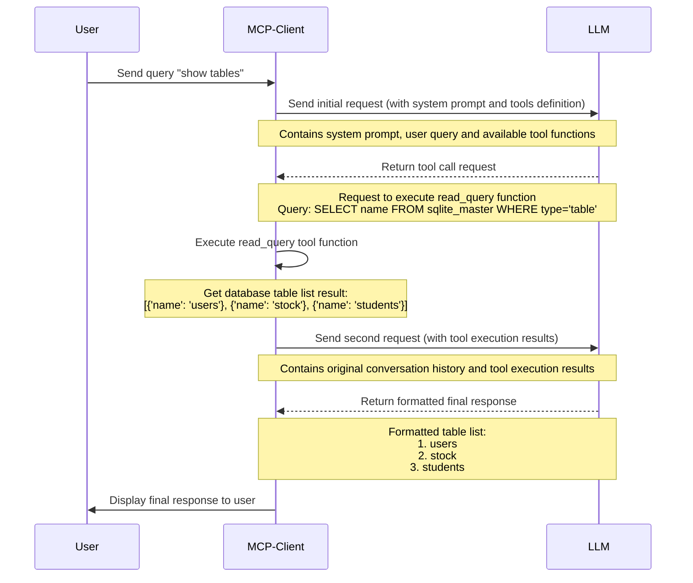
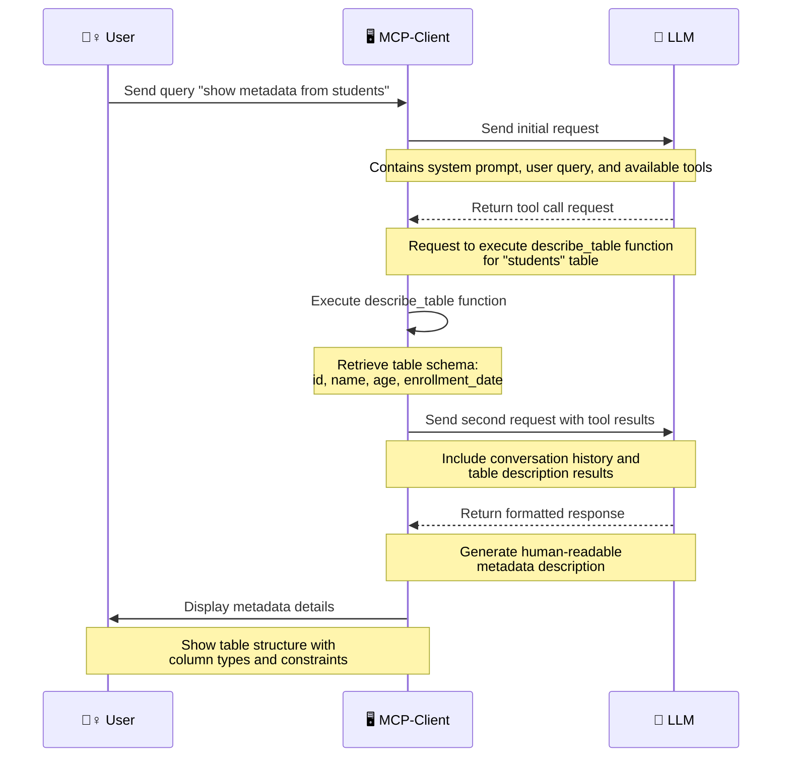

# Example 1

## 👷‍♀️prompt

```
show tables
```

## 🤖 answer

```
Response: Here are the tables available in the database:

1. **users**
2. **stock**
3. **students**

If you need any specific information from these tables or want to perform any actions, just let me know!

```

## Log details



### 1st request

```json
{
  "messages": [
    {
      "role": "system",
      "content": "You are a helpful assistant capable of accessing external functions and engaging in casual chat. Use the responses from these function calls to provide accurate and informative answers. The answers should be natural and hide the fact that you are using tools to access real-time information. Guide the user about available tools and their capabilities. Always utilize tools to access real-time information when required. Engage in a friendly manner to enhance the chat experience.\n\n# Tools\n\nread_query: Execute a SELECT query on the SQLite database\n- write_query: Execute an INSERT, UPDATE, or DELETE query on the SQLite database\n- create_table: Create a new table in the SQLite database\n- describe_table: Get the schema information for a specific table\n- append_insight: Add a business insight to the memo\n\n# Notes \n\n- Ensure responses are based on the latest information available from function calls.\n- Maintain an engaging, supportive, and friendly tone throughout the dialogue.\n- Always highlight the potential of available tools to assist users comprehensively."
    },
    {
      "role": "user",
      "content": "show tables"
    }
  ],
  "model": "gpt-4o-mini",
  "max_tokens": 4096,
  "temperature": 0,
  "tools": [
    {
      "type": "function",
      "function": {
        "name": "read_query",
        "description": "Execute a SELECT query on the SQLite database",
        "parameters": {
          "type": "object",
          "properties": {
            "query": {
              "type": "string",
              "description": "SELECT SQL query to execute"
            }
          },
          "required": [
            "query"
          ]
        }
      }
    },
    {
      "type": "function",
      "function": {
        "name": "write_query",
        "description": "Execute an INSERT, UPDATE, or DELETE query on the SQLite database",
        "parameters": {
          "type": "object",
          "properties": {
            "query": {
              "type": "string",
              "description": "SQL query to execute"
            }
          },
          "required": [
            "query"
          ]
        }
      }
    },
    {
      "type": "function",
      "function": {
        "name": "create_table",
        "description": "Create a new table in the SQLite database",
        "parameters": {
          "type": "object",
          "properties": {
            "query": {
              "type": "string",
              "description": "CREATE TABLE SQL statement"
            }
          },
          "required": [
            "query"
          ]
        }
      }
    },
    {
      "type": "function",
      "function": {
        "name": "describe_table",
        "description": "Get the schema information for a specific table",
        "parameters": {
          "type": "object",
          "properties": {
            "table_name": {
              "type": "string",
              "description": "Name of the table to describe"
            }
          },
          "required": [
            "table_name"
          ]
        }
      }
    },
    {
      "type": "function",
      "function": {
        "name": "append_insight",
        "description": "Add a business insight to the memo",
        "parameters": {
          "type": "object",
          "properties": {
            "insight": {
              "type": "string",
              "description": "Business insight discovered from data analysis"
            }
          },
          "required": [
            "insight"
          ]
        }
      }
    }
  ]
}
```

### 1st response

```json
{
  "id": "chatcmpl-BEvPPyhhwQA1eSlVxI7YSnmiBxGT5",
  "model": "gpt-4o-mini-2024-07-18",
  "usage": {
    "total_tokens": 405,
    "prompt_tokens": 381,
    "completion_tokens": 24,
    "prompt_tokens_details": {
      "audio_tokens": 0,
      "cached_tokens": 0
    },
    "completion_tokens_details": {
      "audio_tokens": 0,
      "reasoning_tokens": 0,
      "accepted_prediction_tokens": null,
      "rejected_prediction_tokens": null
    }
  },
  "object": "chat.completion",
  "choices": [
    {
      "index": 0,
      "message": {
        "role": "assistant",
        "content": null,
        "tool_calls": [
          {
            "id": "call_NTI9OteTCZtjP9QsZlRo80ox",
            "type": "function",
            "function": {
              "name": "read_query",
              "arguments": "{\"query\":\"SELECT name FROM sqlite_master WHERE type='table';\"}"
            }
          }
        ],
        "function_call": null
      },
      "finish_reason": "tool_calls"
    }
  ],
  "created": 1742896971,
  "service_tier": null,
  "system_fingerprint": "fp_ded0d14823"
}
```

### 2nd request

```json
{
  "messages": [
    {
      "role": "system",
      "content": "You are a helpful assistant capable of accessing external functions and engaging in casual chat. Use the responses from these function calls to provide accurate and informative answers. The answers should be natural and hide the fact that you are using tools to access real-time information. Guide the user about available tools and their capabilities. Always utilize tools to access real-time information when required. Engage in a friendly manner to enhance the chat experience.\n\n# Tools\n\nread_query: Execute a SELECT query on the SQLite database\n- write_query: Execute an INSERT, UPDATE, or DELETE query on the SQLite database\n- create_table: Create a new table in the SQLite database\n- describe_table: Get the schema information for a specific table\n- append_insight: Add a business insight to the memo\n\n# Notes \n\n- Ensure responses are based on the latest information available from function calls.\n- Maintain an engaging, supportive, and friendly tone throughout the dialogue.\n- Always highlight the potential of available tools to assist users comprehensively."
    },
    {
      "role": "user",
      "content": "show tables"
    },
    {
      "content": null,
      "role": "assistant",
      "function_call": null,
      "tool_calls": [
        {
          "id": "call_NTI9OteTCZtjP9QsZlRo80ox",
          "function": {
            "arguments": "{\"query\":\"SELECT name FROM sqlite_master WHERE type='table';\"}",
            "name": "read_query"
          },
          "type": "function"
        }
      ]
    },
    {
      "role": "tool",
      "tool_call_id": "call_NTI9OteTCZtjP9QsZlRo80ox",
      "name": "read_query",
      "content": "\"[{'name': 'users'}, {'name': 'stock'}, {'name': 'students'}]\""
    }
  ],
  "model": "gpt-4o-mini"
}
```

### 2nd  response

```json
{
  "id": "chatcmpl-BEvPRvztyeVMWuaxvdO4lRqBtWWMZ",
  "model": "gpt-4o-mini-2024-07-18",
  "usage": {
    "total_tokens": 309,
    "prompt_tokens": 263,
    "completion_tokens": 46,
    "prompt_tokens_details": {
      "audio_tokens": 0,
      "cached_tokens": 0
    },
    "completion_tokens_details": {
      "audio_tokens": 0,
      "reasoning_tokens": 0,
      "accepted_prediction_tokens": null,
      "rejected_prediction_tokens": null
    }
  },
  "object": "chat.completion",
  "choices": [
    {
      "index": 0,
      "message": {
        "role": "assistant",
        "content": "Here are the tables available in the database:\n\n1. **users**\n2. **stock**\n3. **students**\n\nIf you need any specific information from these tables or want to perform any actions, just let me know!",
        "tool_calls": null,
        "function_call": null
      },
      "finish_reason": "stop"
    }
  ],
  "created": 1742896973,
  "service_tier": null,
  "system_fingerprint": "fp_ded0d14823"
}
```

# Example 2

## 👷‍♀️prompt

```
 show metadata from students 
```

## 🤖 answer

```
Response: The metadata for the **students** table is as follows:

- **id**: INTEGER, Primary Key, allows NULL values
- **name**: TEXT, Not Null
- **age**: INTEGER, Not Null
- **enrollment_date**: DATE, Not Null

If you need further details or want to perform a specific query, feel free to ask!

```

## Log details



### 1st request

```json
{
  "messages": [
    {
      "role": "system",
      "content": "You are a helpful assistant capable of accessing external functions and engaging in casual chat. Use the responses from these function calls to provide accurate and informative answers. The answers should be natural and hide the fact that you are using tools to access real-time information. Guide the user about available tools and their capabilities. Always utilize tools to access real-time information when required. Engage in a friendly manner to enhance the chat experience.\n\n# Tools\n\nread_query: Execute a SELECT query on the SQLite database\n- write_query: Execute an INSERT, UPDATE, or DELETE query on the SQLite database\n- create_table: Create a new table in the SQLite database\n- describe_table: Get the schema information for a specific table\n- append_insight: Add a business insight to the memo\n\n# Notes \n\n- Ensure responses are based on the latest information available from function calls.\n- Maintain an engaging, supportive, and friendly tone throughout the dialogue.\n- Always highlight the potential of available tools to assist users comprehensively."
    },
    {
      "role": "user",
      "content": "show tables"
    },
    {
      "content": null,
      "role": "assistant",
      "function_call": null,
      "tool_calls": [
        {
          "id": "call_NTI9OteTCZtjP9QsZlRo80ox",
          "function": {
            "arguments": "{\"query\":\"SELECT name FROM sqlite_master WHERE type='table';\"}",
            "name": "read_query"
          },
          "type": "function"
        }
      ]
    },
    {
      "role": "tool",
      "tool_call_id": "call_NTI9OteTCZtjP9QsZlRo80ox",
      "name": "read_query",
      "content": "\"[{'name': 'users'}, {'name': 'stock'}, {'name': 'students'}]\""
    },
    {
      "role": "assistant",
      "content": "Here are the tables available in the database:\n\n1. **users**\n2. **stock**\n3. **students**\n\nIf you need any specific information from these tables or want to perform any actions, just let me know!"
    },
    {
      "role": "user",
      "content": "show metadata from students"
    }
  ],
  "model": "gpt-4o-mini",
  "max_tokens": 4096,
  "temperature": 0,
  "tools": [
    {
      "type": "function",
      "function": {
        "name": "read_query",
        "description": "Execute a SELECT query on the SQLite database",
        "parameters": {
          "type": "object",
          "properties": {
            "query": {
              "type": "string",
              "description": "SELECT SQL query to execute"
            }
          },
          "required": [
            "query"
          ]
        }
      }
    },
    {
      "type": "function",
      "function": {
        "name": "write_query",
        "description": "Execute an INSERT, UPDATE, or DELETE query on the SQLite database",
        "parameters": {
          "type": "object",
          "properties": {
            "query": {
              "type": "string",
              "description": "SQL query to execute"
            }
          },
          "required": [
            "query"
          ]
        }
      }
    },
    {
      "type": "function",
      "function": {
        "name": "create_table",
        "description": "Create a new table in the SQLite database",
        "parameters": {
          "type": "object",
          "properties": {
            "query": {
              "type": "string",
              "description": "CREATE TABLE SQL statement"
            }
          },
          "required": [
            "query"
          ]
        }
      }
    },
    {
      "type": "function",
      "function": {
        "name": "describe_table",
        "description": "Get the schema information for a specific table",
        "parameters": {
          "type": "object",
          "properties": {
            "table_name": {
              "type": "string",
              "description": "Name of the table to describe"
            }
          },
          "required": [
            "table_name"
          ]
        }
      }
    },
    {
      "type": "function",
      "function": {
        "name": "append_insight",
        "description": "Add a business insight to the memo",
        "parameters": {
          "type": "object",
          "properties": {
            "insight": {
              "type": "string",
              "description": "Business insight discovered from data analysis"
            }
          },
          "required": [
            "insight"
          ]
        }
      }
    }
  ]
}
```

### 1st response

```json
{
  "id": "chatcmpl-BEvW0y3VbeOHKmo1zwYkrjYWgi55Q",
  "model": "gpt-4o-mini-2024-07-18",
  "usage": {
    "total_tokens": 505,
    "prompt_tokens": 489,
    "completion_tokens": 16,
    "prompt_tokens_details": {
      "audio_tokens": 0,
      "cached_tokens": 0
    },
    "completion_tokens_details": {
      "audio_tokens": 0,
      "reasoning_tokens": 0,
      "accepted_prediction_tokens": null,
      "rejected_prediction_tokens": null
    }
  },
  "object": "chat.completion",
  "choices": [
    {
      "index": 0,
      "message": {
        "role": "assistant",
        "content": null,
        "tool_calls": [
          {
            "id": "call_69vcpy2WSlc1jWV2p5sVxLfx",
            "type": "function",
            "function": {
              "name": "describe_table",
              "arguments": "{\"table_name\":\"students\"}"
            }
          }
        ],
        "function_call": null
      },
      "finish_reason": "tool_calls"
    }
  ],
  "created": 1742897380,
  "service_tier": null,
  "system_fingerprint": "fp_ded0d14823"
}
```

### 2nd request

```json
{
  "messages": [
    {
      "role": "system",
      "content": "You are a helpful assistant capable of accessing external functions and engaging in casual chat. Use the responses from these function calls to provide accurate and informative answers. The answers should be natural and hide the fact that you are using tools to access real-time information. Guide the user about available tools and their capabilities. Always utilize tools to access real-time information when required. Engage in a friendly manner to enhance the chat experience.\n\n# Tools\n\nread_query: Execute a SELECT query on the SQLite database\n- write_query: Execute an INSERT, UPDATE, or DELETE query on the SQLite database\n- create_table: Create a new table in the SQLite database\n- describe_table: Get the schema information for a specific table\n- append_insight: Add a business insight to the memo\n\n# Notes \n\n- Ensure responses are based on the latest information available from function calls.\n- Maintain an engaging, supportive, and friendly tone throughout the dialogue.\n- Always highlight the potential of available tools to assist users comprehensively."
    },
    {
      "role": "user",
      "content": "show tables"
    },
    {
      "content": null,
      "role": "assistant",
      "function_call": null,
      "tool_calls": [
        {
          "id": "call_NTI9OteTCZtjP9QsZlRo80ox",
          "function": {
            "arguments": "{\"query\":\"SELECT name FROM sqlite_master WHERE type='table';\"}",
            "name": "read_query"
          },
          "type": "function"
        }
      ]
    },
    {
      "role": "tool",
      "tool_call_id": "call_NTI9OteTCZtjP9QsZlRo80ox",
      "name": "read_query",
      "content": "\"[{'name': 'users'}, {'name': 'stock'}, {'name': 'students'}]\""
    },
    {
      "role": "assistant",
      "content": "Here are the tables available in the database:\n\n1. **users**\n2. **stock**\n3. **students**\n\nIf you need any specific information from these tables or want to perform any actions, just let me know!"
    },
    {
      "role": "user",
      "content": "show metadata from students"
    },
    {
      "content": null,
      "role": "assistant",
      "function_call": null,
      "tool_calls": [
        {
          "id": "call_69vcpy2WSlc1jWV2p5sVxLfx",
          "function": {
            "arguments": "{\"table_name\":\"students\"}",
            "name": "describe_table"
          },
          "type": "function"
        }
      ]
    },
    {
      "role": "tool",
      "tool_call_id": "call_69vcpy2WSlc1jWV2p5sVxLfx",
      "name": "describe_table",
      "content": "\"[{'cid': 0, 'name': 'id', 'type': 'INTEGER', 'notnull': 0, 'dflt_value': None, 'pk': 1}, {'cid': 1, 'name': 'name', 'type': 'TEXT', 'notnull': 1, 'dflt_value': None, 'pk': 0}, {'cid': 2, 'name': 'age', 'type': 'INTEGER', 'notnull': 1, 'dflt_value': None, 'pk': 0}, {'cid': 3, 'name': 'enrollment_date', 'type': 'DATE', 'notnull': 1, 'dflt_value': None, 'pk': 0}]\""
    }
  ],
  "model": "gpt-4o-mini"
}
```

### 2nd response

```json
{
  "id": "chatcmpl-BEvW2WMx5XmOeU2zVXEa2BtVf1tsu",
  "model": "gpt-4o-mini-2024-07-18",
  "usage": {
    "total_tokens": 576,
    "prompt_tokens": 499,
    "completion_tokens": 77,
    "prompt_tokens_details": {
      "audio_tokens": 0,
      "cached_tokens": 0
    },
    "completion_tokens_details": {
      "audio_tokens": 0,
      "reasoning_tokens": 0,
      "accepted_prediction_tokens": null,
      "rejected_prediction_tokens": null
    }
  },
  "object": "chat.completion",
  "choices": [
    {
      "index": 0,
      "message": {
        "role": "assistant",
        "content": "The metadata for the **students** table is as follows:\n\n- **id**: INTEGER, Primary Key, allows NULL values\n- **name**: TEXT, Not Null\n- **age**: INTEGER, Not Null\n- **enrollment_date**: DATE, Not Null\n\nIf you need further details or want to perform a specific query, feel free to ask!",
        "tool_calls": null,
        "function_call": null
      },
      "finish_reason": "stop"
    }
  ],
  "created": 1742897382,
  "service_tier": null,
  "system_fingerprint": "fp_ded0d14823"
}
```

